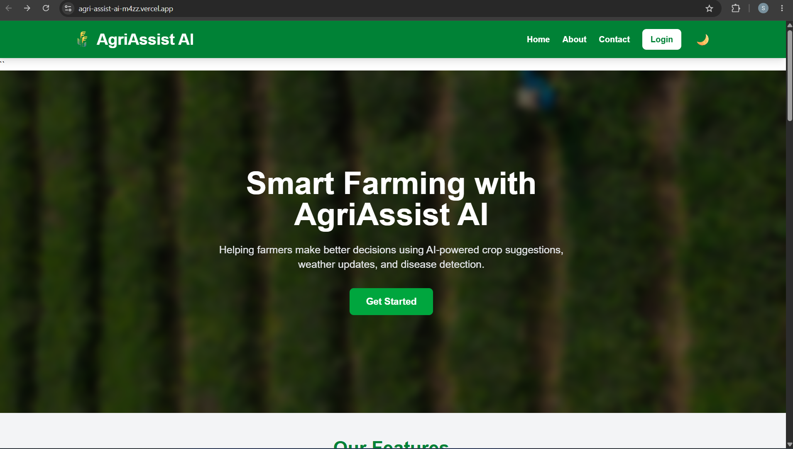
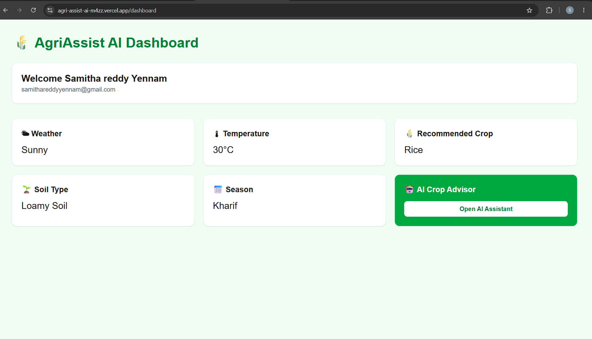
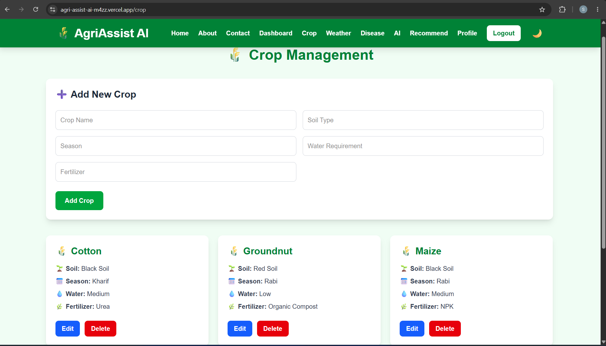
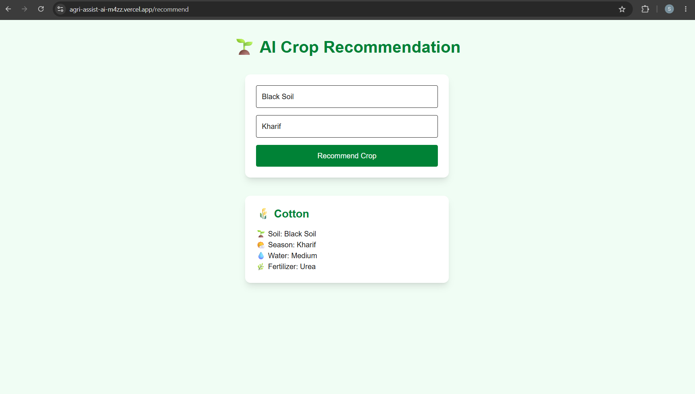

# 🌾 AgriAssist AI

AgriAssist AI is a full-stack smart farming assistant that helps farmers manage crop information and make better farming decisions through crop recommendations and agricultural features.

## 🚀 Live Demo

**Live Application:**
https://agri-assist-ai-m4zz.vercel.app

**GitHub Repository:**
https://github.com/samithareddyyennam-bit/AgriAssist-AI

---

## 📸 Screenshots

### Login / Home



### Dashboard



### Crop Management



### AI Crop Recommendation



---

## ✨ Features

* 🔐 Google authentication and secure login using NextAuth
* 📊 Personalized dashboard after login
* 🌾 Crop management with Add, View, Edit and Delete operations
* 🌱 Crop recommendation based on soil type and season
* 🌤️ Weather and agricultural information
* 🤖 AI-assisted crop recommendation feature
* 🩺 Agricultural disease-related feature
* 👤 User profile page
* 🌗 Responsive user interface with theme support
* 📱 Responsive design for desktop and mobile devices
* 🔗 Full-stack communication between frontend and backend APIs

---

## 🛠️ Tech Stack

### Frontend

* Next.js
* React
* JavaScript
* Tailwind CSS
* NextAuth.js
* React Hot Toast

### Backend

* Node.js
* Express.js
* REST APIs

### Database

* PostgreSQL

### Authentication

* NextAuth.js
* Google OAuth

### AI / Recommendation

* Crop recommendation based on agricultural inputs such as soil type and season
* Backend data-driven recommendation logic

### Deployment

* **Frontend:** Vercel
* **Backend:** Render
* **Database:** PostgreSQL

---

## 📁 Project Structure

```text
AgriAssist-AI/
│
├── frontend/
│   ├── app/
│   │   ├── about/
│   │   ├── ai/
│   │   ├── api/
│   │   │   └── auth/
│   │   ├── contact/
│   │   ├── crop/
│   │   ├── dashboard/
│   │   ├── disease/
│   │   ├── login/
│   │   ├── profile/
│   │   ├── recommend/
│   │   ├── weather/
│   │   ├── globals.css
│   │   ├── layout.js
│   │   └── providers.js
│   │
│   ├── components/
│   │   ├── Navbar.js
│   │   └── ui/
│   │
│   ├── middleware.js
│   ├── package.json
│   └── .env.local
│
├── backend/
│   ├── routes/
│   │   └── crops.js
│   ├── config/
│   │   └── db.js
│   ├── server.js
│   └── package.json
│
└── README.md
```

> File extensions may vary between `.js` and `.jsx` depending on the component.

---

## ⚙️ Setup Instructions

### 1. Clone the repository

```bash
git clone https://github.com/samithareddyyennam-bit/AgriAssist-AI.git
```

Move into the project:

```bash
cd AgriAssist-AI
```

---

### 2. Setup the frontend

```bash
cd frontend
```

Install dependencies:

```bash
npm install
```

Create a `.env.local` file inside the `frontend` folder.

Add:

```env
NEXT_PUBLIC_API_URL=YOUR_BACKEND_URL

NEXTAUTH_URL=http://localhost:3000
NEXTAUTH_SECRET=YOUR_NEXTAUTH_SECRET

GOOGLE_CLIENT_ID=YOUR_GOOGLE_CLIENT_ID
GOOGLE_CLIENT_SECRET=YOUR_GOOGLE_CLIENT_SECRET
```

For the deployed application, `NEXT_PUBLIC_API_URL` points to the deployed Render backend.

---

### 3. Setup the backend

Open another terminal and move to the backend directory:

```bash
cd backend
```

Install dependencies:

```bash
npm install
```

Configure the PostgreSQL database and the environment variables required by the backend database configuration.

Make sure the PostgreSQL database contains the required `crops` table.

---

### 4. Start the backend

Run:

```bash
npm start
```

The backend will run on the configured server port.

---

### 5. Start the frontend

Inside the `frontend` directory:

```bash
npm run dev
```

Open:

```text
http://localhost:3000
```

---

## 🔐 Environment Variables

### Frontend

```env
NEXT_PUBLIC_API_URL=YOUR_BACKEND_URL
NEXTAUTH_URL=http://localhost:3000
NEXTAUTH_SECRET=YOUR_SECRET
GOOGLE_CLIENT_ID=YOUR_GOOGLE_CLIENT_ID
GOOGLE_CLIENT_SECRET=YOUR_GOOGLE_CLIENT_SECRET
```

### Production

The deployed frontend uses the production backend URL through:

```env
NEXT_PUBLIC_API_URL=https://agriassist-ai-t6bf.onrender.com
```

> Never commit `.env.local`, API secrets, OAuth secrets, database passwords, or other sensitive credentials to GitHub.

---

# 📡 API Documentation

The backend exposes REST APIs for crop management and recommendations.

## Get all crops

**GET**

```text
/api/crops
```

Example:

```text
GET /api/crops
```

Response:

```json
[
  {
    "id": 1,
    "name": "Rice",
    "soil": "Black Soil",
    "season": "Kharif",
    "water": "High",
    "fertilizer": "Nitrogen"
  }
]
```

---

## Search crops

**GET**

```text
/api/crops/search?q=rice
```

Example response:

```json
[
  {
    "id": 1,
    "name": "Rice",
    "soil": "Black Soil",
    "season": "Kharif"
  }
]
```

---

## Crop Recommendation

**GET**

```text
/api/crops/recommend?soil=Black%20Soil&season=Kharif
```

Example:

```text
GET /api/crops/recommend?soil=Black%20Soil&season=Kharif
```

Successful response:

```json
{
  "id": 1,
  "name": "Rice",
  "soil": "Black Soil",
  "season": "Kharif",
  "water": "High",
  "fertilizer": "Nitrogen"
}
```

If no matching crop is found:

```json
{
  "message": "No crop found"
}
```

---

## Add Crop

**POST**

```text
/api/crops
```

Request:

```json
{
  "name": "Rice",
  "soil": "Black Soil",
  "season": "Kharif",
  "water": "High",
  "fertilizer": "Nitrogen"
}
```

---

## Update Crop

**PUT**

```text
/api/crops/:id
```

Example:

```text
PUT /api/crops/1
```

Request:

```json
{
  "name": "Rice",
  "soil": "Black Soil",
  "season": "Kharif",
  "water": "High",
  "fertilizer": "Nitrogen"
}
```

---

## Delete Crop

**DELETE**

```text
/api/crops/:id
```

Example:

```text
DELETE /api/crops/1
```

Successful response:

```json
{
  "message": "Crop deleted successfully!"
}
```

---

## Get Crop by ID

**GET**

```text
/api/crops/:id
```

Example:

```text
GET /api/crops/1
```

---

# 🏗️ Architecture

AgriAssist AI follows a three-layer full-stack architecture.

```text
                ┌──────────────────────┐
                │      User / Browser  │
                └──────────┬───────────┘
                           │
                           ▼
                ┌──────────────────────┐
                │ Next.js Frontend     │
                │ React + Tailwind CSS │
                │ NextAuth             │
                └──────────┬───────────┘
                           │ REST API
                           ▼
                ┌──────────────────────┐
                │ Express.js Backend   │
                │ Node.js REST APIs    │
                └──────────┬───────────┘
                           │
                           ▼
                ┌──────────────────────┐
                │ PostgreSQL Database  │
                │ Crop Information     │
                └──────────────────────┘
```

### Deployment Architecture

```text
User
 │
 ▼
Vercel
 │
 │ API Requests
 ▼
Render
 │
 ▼
PostgreSQL
```

---

# ⚠️ Known Limitations

* Some agricultural recommendations depend on the crop information available in the database.
* Recommendation results are currently based on soil and season matching.
* Some advanced AI functionality is planned for future improvements.
* Free-tier hosting services may experience cold starts or slower response times.
* Weather and other external services may depend on their respective APIs and availability.
* The application is intended as an assistance tool and should not replace professional agricultural advice.

---

# 📚 Learning Outcomes

During the development of AgriAssist AI, I gained practical experience in:

* Building a full-stack web application
* Developing React and Next.js interfaces
* Creating REST APIs using Express.js
* Connecting applications with PostgreSQL
* Implementing Google authentication using NextAuth
* Managing frontend and backend communication
* Deploying applications using Vercel and Render
* Debugging production deployment issues
* Working with environment variables
* Building CRUD functionality
* Creating responsive user interfaces
* Documenting a complete software project

---

# 🙏 Credits & Acknowledgements

This project was developed as part of the **TBI-GEU Summer Internship Program**.

I would like to thank the internship mentors and program team for providing guidance, resources, and the opportunity to work on a full-stack project.

### Tools and Resources Used

* Next.js Documentation
* React Documentation
* Express.js Documentation
* PostgreSQL Documentation
* NextAuth Documentation
* Tailwind CSS Documentation
* Vercel Documentation
* Render Documentation
* GitHub Documentation

AI-assisted development tools were also used during development for debugging, learning, code suggestions, and improving the application.

---

# 👩‍💻 Developer

**Yennam Samitha Reddy**

B.Tech — Artificial Intelligence & Machine Learning

GitHub:
https://github.com/samithareddyyennam-bit

---

## 📌 Project Status

**Status:** Completed — Internship Capstone Project

AgriAssist AI demonstrates a complete full-stack application with authentication, dashboard functionality, crop management, agricultural recommendation features, REST APIs, database integration, and cloud deployment.
